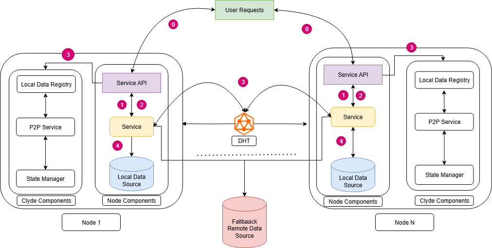

## Clyde
Clyde is a high-peprformance peer-to-peer (P2P) data acceleration engine designed  designed for rapid, large-scale delivery across heterogeneous compute environments. Currently, it specializes in fast container image distribution across nodes in a clusters. We are expanding its capabilities to support general content delivery, including AI model weights, datasets, and remote repository content (e.g., Git LFS, Hugging Face, pip, etc.). Clyde integrates with Apull to enable lazy loading of images.

## Architecture

See more in the [design and architecture](./docs/design.md) guide.
## Main Features

1. **Design Simplicity:** Clyde uses a simplified stateless design making it performant and easy to extend
2. **Speed:** Data is cached locally on nodes and transmitted through the P2P network to enable faster delivery accross the cluster
3. **Saving:** Save bandwidth by serving content locally instead
4. **Varsatile:** Avoids rate-limitting and Works even when the external sources is down
4. **Lazy Loading:** Suppoprts lazy loading which significantly reduces container startup

## Design & Architecture
Follow the [design and architecture](./docs/design.md) to understand the design and architecture of Clyde.

## Build and Instal
Follow the building and installation instruction see [build](./docs/build.md) and [guide](./docs/install.md) respectively to get started

## Contribution
Read [contribution guidelines](./docs/contributing.md) for instructions on how to build and test Spegel.

## Acknowledgement
Many thanks to the developers of [Spegel](https://github.com/spegel-org/spegel) especialy Philip.
