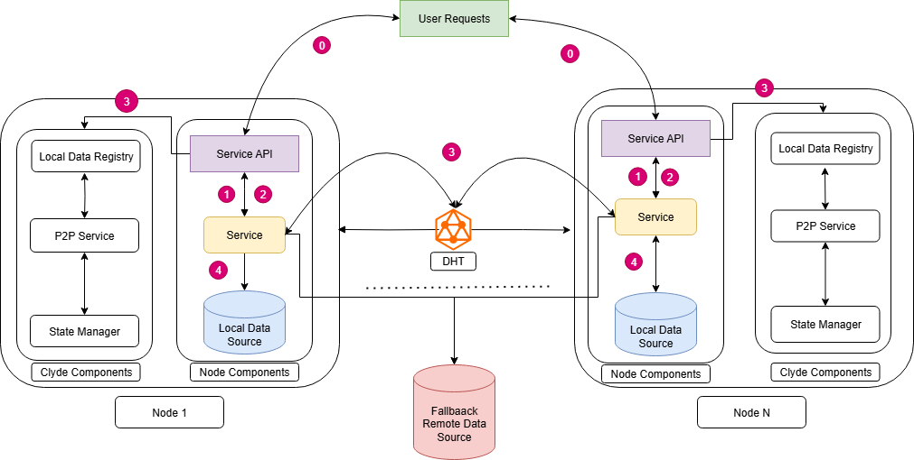

## Design & Architecture

## Clyde Components
The Clyde components runs on each node to which is responsible for interacting with the data service api on the node such as containerd for pulling and managing images

### Local Data Registry
The Data Registry Service is responsible for implementing a local registry on each node that can store, serve, and respond to requests for data artifacts such as container images or Python packages. This registry acts as the first point of resolution for incoming fetch requests, reducing latency and external bandwidth usage by avoiding unnecessary access to remote registries. For example, if a node attempts to docker pull or pip install a package, the request is first redirected to this local registry, which serves the content if it is already available locally.

### P2P Service
The P2P Component includes a DHT-based peer discovery and routing system implemented using the libp2p library, along with a bootstrapper that connects each node to the network. This component enables nodes to advertise available data and resolve content keys to peer addresses, effectively transforming the network into a distributed cache. For example, when a pip package is not found locally, the node queries the DHT to find peers that have advertised the package under a key such as pypi/package/torch-2.1.0.whl, allowing the node to fetch it directly from another peer without going to PyPI.

### State Manager
The State Manager component is designed to interface with the underlying container runtime (e.g., containerd) to gather real-time metrics, container lifecycle events, and usage statistics. This information is critical for making informed decisions about what data to retain, evict, or prefetch based on local demand and system constraints. For instance, the State Manager can track the most frequently accessed OCI layers or pip packages, enabling the system to prioritize them for local storage and advertisement.

## Node Components

### Service
Each node runs one or more services such as containerd, pip, or git, which are configured to forward their fetch requests to the Clyde proxy. This redirection allows Clyde to intercept requests like docker pull, pip install, or git clone, enabling local or P2P resolution before falling back to upstream sources. For example, pip is configured to use a custom index URL pointing to Clyde’s proxy endpoint.

### Service API
The Service API defines how Clyde interacts with the supported services by conforming to their expected protocols and endpoints. It handles incoming HTTP or gRPC requests and ensures compatibility with existing tooling. For instance, Clyde responds to image pull queries just as a registry mirror would, allowing seamless substitution.

### Local Data Source
The Local Data Source is the storage backend where content such as container image layers, wheel files, or git objects are stored once fetched. Clyde uses this store to resolve requests locally and to advertise available content over the P2P network. As an example, after a node pulls a container, the corresponding image layer files are stored locally and becomes available for other peers to download.

## User sequence Diagram

